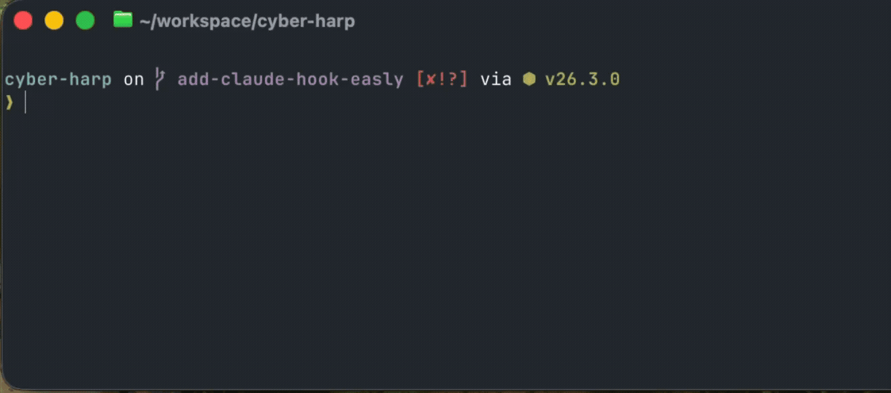
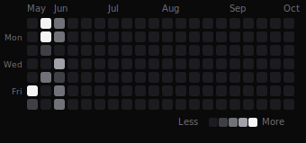

<div align="center">

# HookStack

**Your AI agent runs fast. Hooks keep it honest.**

Production-ready hooks — for **Claude Code, OpenAI Codex, and GitHub Copilot**.  
Only in one command — your agent gets guardrails in under a minute.

[](https://docs.anthropic.com/en/docs/claude-code/overview)
[](https://openai.com/codex)
[](https://github.com/features/copilot)
[](LICENSE)
[](https://www.hookstack.app)
[](https://nextjs.org)
[](https://www.typescriptlang.org)
[](https://github.com/steve-magne/hookstack/actions/workflows/codeql.yml)
[](https://snyk.io/test/github/steve-magne/hookstack)




</div>

## Installation

Installation takes under a minute.

```bash
npx hookstack-cli@latest install
```

That's it. The CLI walks you through picking hooks, writes the `.mjs` scripts, and patches the right config file — no manual copy-paste, no JSON editing. The interactive menu lets you pick your target agent.

>Want to fine-tune your Hookstack? Go to **[hookstack.app](https://www.hookstack.app)** — browse the full catalogue, select exactly what you need, copy the generated command and paste it in your terminal
---

<!-- HOOKS_TIMELINE:START -->

## The HookStack evolution

**102 hooks** and counting — every one dogfooded on this repo, unit-tested, and shipped in public.

<p align="center">
  <a href="https://www.hookstack.app/evolution">
    
  </a>
</p>

<sub>First hook 2026-05-29 · latest 2026-06-13 · explore the live timeline → <a href="https://www.hookstack.app/evolution"><b>hookstack.app/evolution</b></a></sub>

<!-- HOOKS_TIMELINE:END -->

## Latest additions

| Hook | Category | Added |
|---|---|---|
| [PII redactor for display](https://www.hookstack.app/hook/message-display-redact-pii) | security | Jun 13, 2026 |
| [Force implementation doc at stop](https://www.hookstack.app/hook/stop-force-implementation-doc) | documentation | Jun 13, 2026 |
| [Dead link checker](https://www.hookstack.app/hook/stop-dead-link-checker) | documentation | Jun 13, 2026 |
| [Single H1 heading guard](https://www.hookstack.app/hook/seo-heading-hierarchy-guard) | validation | Jun 12, 2026 |
| [SEO structure gate](https://www.hookstack.app/hook/stop-seo-structure-check) | validation | Jun 12, 2026 |
| [SEO page metadata guard](https://www.hookstack.app/hook/seo-page-metadata-guard) | validation | Jun 12, 2026 |
| [Next.js image guard](https://www.hookstack.app/hook/seo-next-image-guard) | validation | Jun 12, 2026 |
| [JSX accessibility guard](https://www.hookstack.app/hook/a11y-jsx-guard) | validation | Jun 12, 2026 |

<sub>→ <a href="https://www.hookstack.app/evolution">Full timeline on hookstack.app/evolution</a></sub>

## Promise

Install a production-ready HookStack in one command — up and running in 60 seconds, on Claude Code, OpenAI Codex, or GitHub Copilot.

---

## How it works

The moment your agent starts a session, it knows absolutely nothing about your environment. It doesn't know which branch you're on, doesn't know your `.env` has secrets, doesn't know that `rm -rf /` is a terrible idea. It just runs.

Hooks change that.

A hook is an ordinary Node.js script wired into the agent lifecycle via a config file. No SDK, no plugin system — just events. When the agent is about to run a shell command, a `PreToolUse` hook fires first. It reads the full command, and it can **block** it. When the agent writes a file, a `PostToolUse` hook can reformat it automatically. When a long task finishes, a `Stop` hook can ping your phone.

Hookstack is the catalogue of these scripts — written, tested, and ready to install. You pick the ones you want, run one `npx` command, and your project gets a hooks folder and a patched config file. Done.

**Agent-agnostic by design.** Claude Code, OpenAI Codex, and GitHub Copilot share the same lifecycle event model, so the hook code is identical across all three — only the config file format differs (`.claude/settings.json` vs `.codex/hooks.json`). Write a hook once, deploy it on whichever agent you (or your team) run.

The result: your agent still moves fast. It just can't do the dumb things anymore.

---

## Sponsorship

If Hookstack has saved your production secrets or stopped a runaway `rm -rf`, I'd love it if you'd [give the repo a star](https://github.com/steve-magne/hookstack) or [sponsor the work](https://github.com/sponsors/steve-magne).

Thanks!
— Steve

---

## The Lifecycle

Hooks fire at 25 distinct points in the Claude Code agent loop. Here is how the most important ones fit together:

**1. SessionStart — set the stage**

Fires the instant a session opens. Use it to inject context: current branch, recent commits, open issues. Your agent starts informed instead of cold.

**2. PreToolUse — intercept before it's too late**

Fires *before* any tool executes and can block it outright. The right place for security: secrets in commands, destructive filesystem ops, pushes to `main`, writes to `.env`. The agent sees your `reason` and adjusts — it doesn't just get a wall.

**3. PostToolUse — observe and react**

Fires *after* a tool completes, non-blocking. Run ESLint + Prettier after every file write. Record what the agent touched. Validate that the file it wrote actually parses. The agent keeps moving; the hook handles the cleanup.

**4. Stop / StopFailure — close the loop**

Fires when the agent finishes (success or failure). Ping Slack. Send a push notification. Write a session summary to disk. The work is done — now you find out about it.

**5. WorktreeCreate — bootstrap new environments**

Fires when a new worktree is created. Copy `.env`, assign a free port, run `pnpm install`. Every worktree starts ready, not broken.

---

## What's Inside

### Security

- **pre-bash-secret-detection** — Catches API keys, tokens, and passwords before any shell command runs
- **pre-write-secret-detection** — Blocks the agent from hardcoding a secret into any file it writes
- **pre-bash-block-destructive** — Blocks `rm -rf /`, `DROP TABLE`, direct disk writes, and other foot-guns
- **pre-edit-protect-paths** — `.env` and key files stay untouched by the agent, always
- **pre-read-env-guard** — `.env` secrets never enter the model context in the first place
- **pre-bash-guard-git-push-main** — Hard stop on any `git push` targeting `main` or `master`

### Context

- **session-start-load-git-context** — Injects current branch, status, and last commit at session start
- **session-start-github-context** — Open PRs and CI check status loaded before you ask
- **worktree-create-setup-env** — Copies `.env`, assigns a free port, runs install — every worktree, every time
- **pre-read-file-to-markdown** — Read any PDF, DOCX or PPTX as clean Markdown — slash token usage

### Validation

- **stop-per-file-coverage** — After each session, flags any file touched without test coverage ≥ 80 %
- **stop-per-file-lint** — ESLint runs on every file the agent modified before Stop fires
- **post-write-autoformat** — Prettier auto-formats silently after every Write or Edit
- **pre-bash-enforce-package-managers** — Blocks `npm` or `yarn` commands when the project uses `pnpm`
- **post-edit-typecheck** — Runs `tsc --noEmit` on touched TypeScript files right after an edit
- **post-edit-conflict-marker-check** — Leftover merge conflict markers caught the moment a file is written

### Notification

- **notification-slack** — Pings your Slack when the agent needs you mid-session
- **stop-sound** — A completion chime the moment Claude finishes
- **stop-tts-completion** — Get told out loud the moment work is done

### Workflow

- **session-start-worktree-if-main** — Start a session on `main` and you're moved to a fresh worktree
- **post-bash-command-log** — A full history of every command Claude ran
- **registry-changed-auto-sync** — Re-syncs `registry.json` whenever a hook `.mjs` is edited (meta: powers this repo)

### Documentation

- **stop-generate-changelog** — An automatic changelog of what the agent shipped, session by session

---

## Philosophy

- **Hooks are not plugins.** They are ordinary shell scripts. No SDK, no agent modification — just events and `settings.json`.
- **Block early, not late.** A `PreToolUse` hook that stops a bad command costs nothing. A runaway `rm -rf` costs everything.
- **Zero overhead by default.** Hooks that don't match exit in milliseconds. A `PostToolUse` hook that can't find ESLint is silent, not crashing.
- **Tested like production code.** Every hook in the catalogue ships with a Vitest unit test. The CI gate rejects any hook without coverage ≥ 80 %.
- **Dogfooded.** The hooks in this catalogue are active on this very repository. They run on every Claude Code session that touches `hookstack`. Bugs surface fast.

---

## Contributing

### Via a pull request

1. Fork the repository
2. Write your hook as `.claude/hooks/<slug>.mjs` following the [conventions below](#hook-conventions)
3. Add a test in `tests/hooks/<slug>.test.mjs` and verify `pnpm test` passes
4. Add the metadata entry to `registry/registry.json` (see the schema in [CLAUDE.md](CLAUDE.md))
5. Run `node .claude/sync-hooks.mjs` to propagate the code into `code_snippet`
6. Submit a PR — CI runs `pnpm typecheck`, `pnpm test`, and a drift check

### Hook conventions (short version)

- One file, one responsibility. No catch-all hooks.
- Export `run(input, deps = {})` — pure logic, injectable fakes, returns a result or `null`.
- The entry-point guard reads stdin, calls `run`, marshalls — nothing else.
- `PreToolUse` hooks must provide an actionable `reason`, not just "blocked".
- `PostToolUse` hooks must be non-blocking: tool-absent errors are silent.
- Timeout every `execSync` call — no hook should hang indefinitely.

Full conventions: [CLAUDE.md → Conventions hooks](CLAUDE.md#conventions-hooks-claude-code).

---

## Run locally

```bash
git clone https://github.com/steve-magne/hookstack.git
cd hookstack
pnpm install
pnpm dev          # → http://localhost:3000
```

```bash
# pnpm typecheck   \
# pnpm lint         > Don't need those — Hookstack does it for you.
# pnpm test        /
pnpm build        # Production build
```

<details>
<summary><strong>Tech stack</strong></summary>

| Layer | Technology |
|---|---|
| Framework | [Next.js 15](https://nextjs.org) — App Router, Server Components |
| Language | TypeScript 5.x |
| Styling | Tailwind CSS v4 |
| Animations | [Motion](https://motion.dev) (ex-Framer Motion) — springs, split-flap, FLIP |
| State | [Zustand](https://github.com/pmndrs/zustand) — persisted selection |
| CI enrichment | GitHub Actions + Claude Code (`ANTHROPIC_API_KEY`) |
| Package manager | pnpm 9.x |

</details>

---

## Updating

```bash
npx hookstack-cli@latest update
```

The CLI re-fetches each installed hook from the registry and overwrites the local `.mjs`. Your `settings.json` is not touched unless the config fragment changed.

---

## Guides

Five short guides on Claude Code hooks — from first principles to production debugging:

- [**What are Claude Code hooks?**](https://www.hookstack.app/guides/what-are-claude-code-hooks) — the concept explained in plain language: what an event is, how settings.json wires it, and when to reach for a hook vs a slash-command.
- [**PreToolUse vs PostToolUse**](https://www.hookstack.app/guides/pretooluse-vs-posttooluse) — when to block (PreToolUse) vs when to observe and react (PostToolUse), with concrete examples of each.
- [**Claude Code hooks vs slash commands**](https://www.hookstack.app/guides/claude-code-hooks-vs-slash-commands) — the two extension points compared: trigger model, blocking capability, and the right choice for each use-case.
- [**Claude Code hooks not working?**](https://www.hookstack.app/guides/claude-code-hooks-not-working) — a practical troubleshooting checklist: permissions, shebang, stdin parsing, exit codes, and the most common mistakes.
- [**Write your first Claude Code hook**](https://www.hookstack.app/guides/write-your-first-claude-code-hook) — a step-by-step walkthrough from an empty `.mjs` to a tested, wired hook in under 10 minutes.

---

## Community

Hookstack is built by [Steve Magne](https://github.com/steve-magne) with contributions from the Claude Code community.

- **Catalogue**: [hookstack.app](https://www.hookstack.app)
- **Guides**: [hookstack.app/guides](https://www.hookstack.app/guides) — what hooks are, PreToolUse vs PostToolUse, hooks vs slash-commands
- **About**: [hookstack.app/about](https://www.hookstack.app/about)
- **Issues**: [github.com/steve-magne/hookstack/issues](https://github.com/steve-magne/hookstack/issues)
- **Contribute a hook**: [hookstack.app/contribute](https://www.hookstack.app/contribute)
- **npm**: [npmjs.com/package/hookstack-cli](https://www.npmjs.com/package/hookstack-cli)

---

<div align="center">
  <sub>Built by <a href="https://github.com/steve-magne">@steve-magne</a> · MIT License · PRs welcome</sub>
</div>
